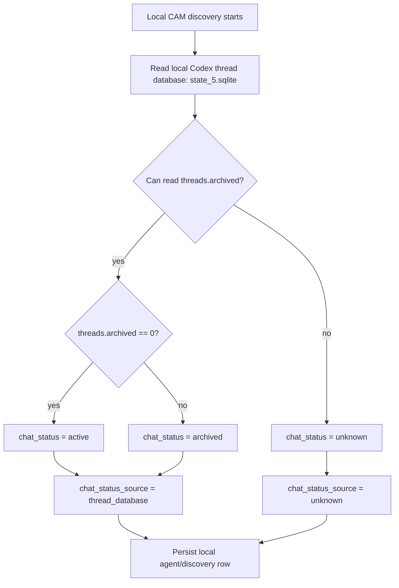
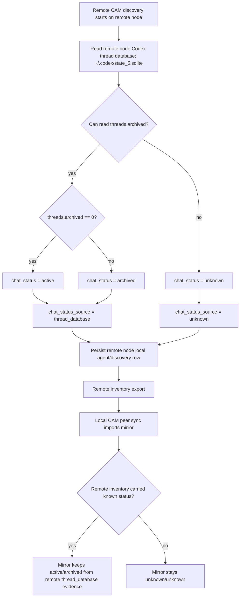
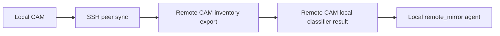
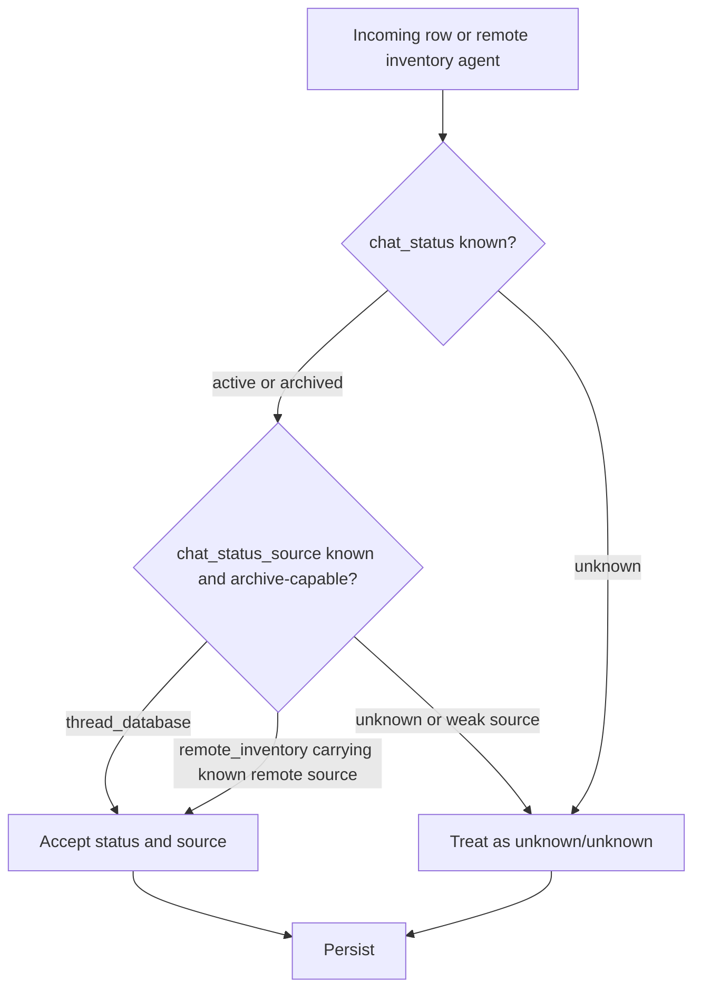
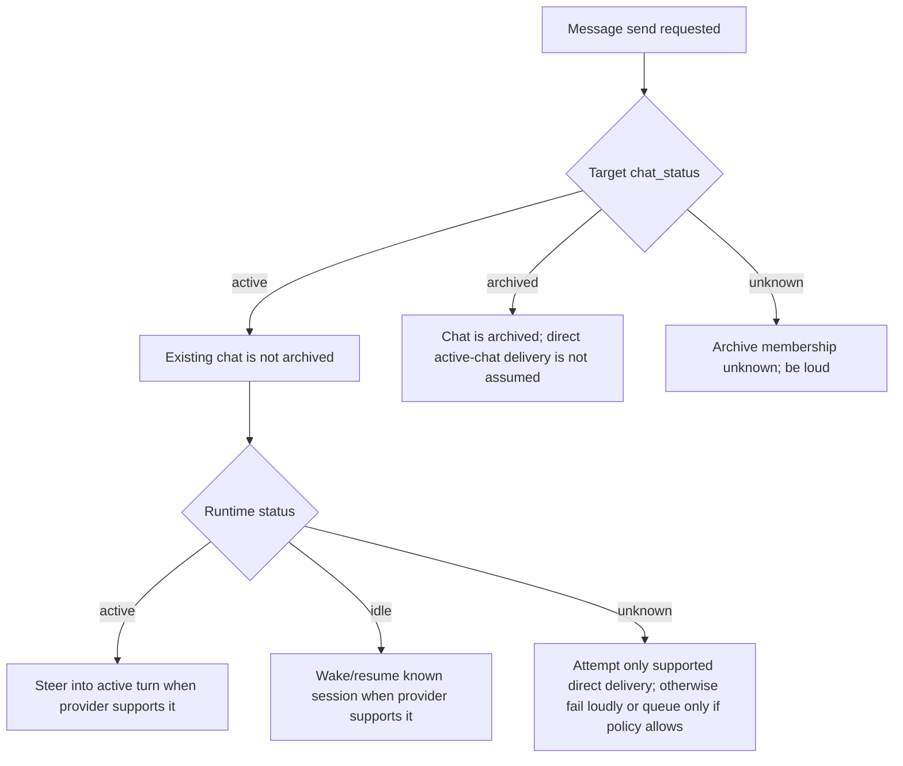

# CAM Chat Classifier Diagram

Purpose: document how CAM classifies chats as `active`, `archived`, or `unknown` without confusing CAM's chat status with Codex runtime status.

Last updated: 2026-06-15.

## Vocabulary

CAM chat status is binary when evidence exists:

- `active`: the chat is not archived in the owning Codex chat list.
- `archived`: the chat is archived in the owning Codex chat list.
- `unknown`: CAM does not have archive-capable evidence.

CAM runtime status is separate:

- `active`: the provider reports or CAM believes a turn is currently active.
- `idle`: the agent has no active turn.
- `unknown`: runtime state is not known.

Do not use runtime `active` or `idle` to classify chat status.

## Current Named Frontend Active Chats

The current human-facing active frontend chats are:

- GitHub
- FlowLab front
- website style stage front
- chatbot style stage front
- speed stage front
- no more

These names are operator context. They do not replace classifier evidence.

## Core Rule

Only archive-capable sources may produce `chat_status = active` or `chat_status = archived`.

Weak sources must stay `unknown`:

- session file presence
- rollout JSONL presence
- session index presence
- Codex state presence
- thread id presence
- runtime active/idle status
- copied snapshots without archive membership evidence

## Local Classifier

Local CAM classifies chats owned by the local machine.

For the Windows desktop local node, local CAM reads the local Codex thread database:

```text
%USERPROFILE%\.codex\state_5.sqlite
```

The authoritative field is:

```text
threads.archived
```

Mapping:

```text
archived = 0 -> chat_status = active
archived != 0 -> chat_status = archived
source -> chat_status_source = thread_database
```

Diagram:



## Remote Classifier

Remote CAM classifies chats owned by the remote machine.

Remote nodes may have:

- Codex CLI chats started directly on that remote node.
- Codex CLI chats started on that remote node by local desktop Codex.

That does not change the classifier rule. The remote CAM still classifies what it can prove from its own local Codex data.

On a Linux remote node, remote CAM reads that node's local Codex thread database:

```text
~/.codex/state_5.sqlite
```

The authoritative field is:

```text
threads.archived
```

Mapping:

```text
archived = 0 -> chat_status = active
archived != 0 -> chat_status = archived
source -> chat_status_source = thread_database
```

Diagram:



## Local View Of Remote Chats

The normal path is:



Local CAM should not invent remote chat metadata status from weak local copies.

If local desktop Codex has a separate, durable, archive-capable metadata record for remote chats, it may become an additional source later. Until that source is identified and documented, it is not authoritative classifier evidence.

## Merge Rule

Known status may be carried only with known evidence.



Do not preserve stale known status when fresh remote inventory says `unknown`.

Do not preserve stale source when status is `unknown`.

## Delivery Rule Connected To Classification

Chat classification is used for routing confidence, not as proof of runtime readiness.



## Anti-Drift Rules

- Never classify from session presence.
- Never classify from rollout presence.
- Never classify from runtime status.
- Never classify from copied snapshots unless the snapshot carries archive-capable evidence.
- `unknown` with `chat_status_source != unknown` is invalid state.
- `active` or `archived` with `chat_status_source = unknown` is suspect state and should be repaired only from archive-capable evidence.
- The GUI must show both `chat_status` and `chat_status_source`.
- Logs must make the classifier source visible.
