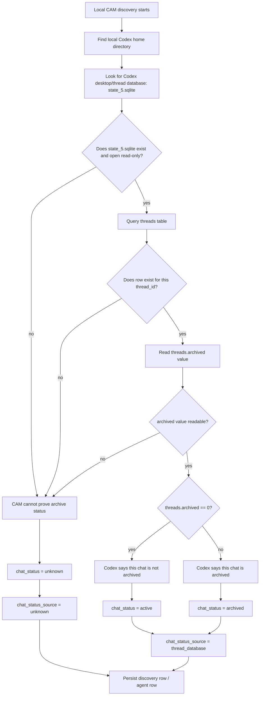

# Local Chat Classifier Detail

This section explains the local CAM chat classifier in detail.

Local CAM asks:

```text
For chats that belong to this machine, can I prove whether Codex considers this chat active or archived?
```

It does not ask whether the agent is currently working.

It does not ask whether a turn is running.

It does not ask whether a session file exists.

It only asks whether Codex's own chat list says the chat is archived or not archived.

## Detailed Diagram



## Plain-English Flow

1. Local CAM starts discovery.

2. It finds the local Codex data store.

3. It opens `state_5.sqlite` read-only.

4. It looks for the Codex `threads` table.

5. For each discovered thread, it reads the `archived` field.

6. If `archived == 0`, CAM says:

```text
chat_status = active
chat_status_source = thread_database
```

7. If `archived != 0`, CAM says:

```text
chat_status = archived
chat_status_source = thread_database
```

8. If CAM cannot read the database, cannot find the row, cannot read the field, or cannot prove the value, CAM says:

```text
chat_status = unknown
chat_status_source = unknown
```

## Important Distinction

```text
chat_status = active
```

means:

```text
This chat is visible/non-archived in Codex's chat list.
```

It does not mean:

```text
The agent is currently thinking.
```

That other concept is runtime status:

```text
runtime status = active / idle / unknown
```

So CAM has two separate truths:

```text
chat_status: is this chat archived or not archived?
runtime_status: is this agent currently working or idle?
```

## Strict Evidence Rule

The classifier is intentionally strict.

It only trusts `threads.archived` because that is actual archive membership evidence.

Everything else stays unknown.

